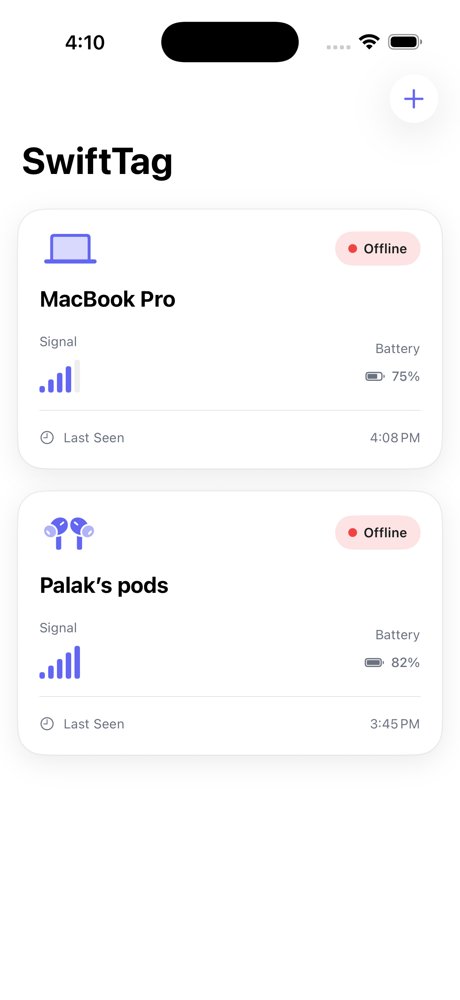
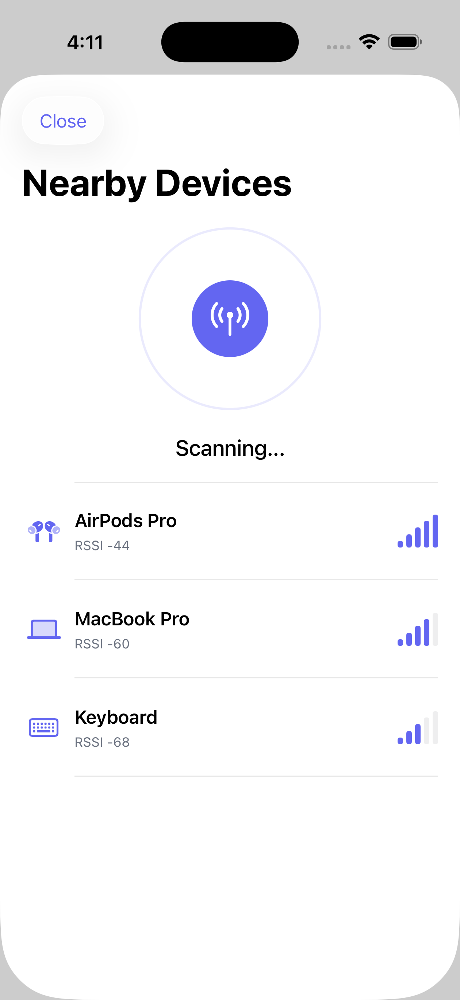
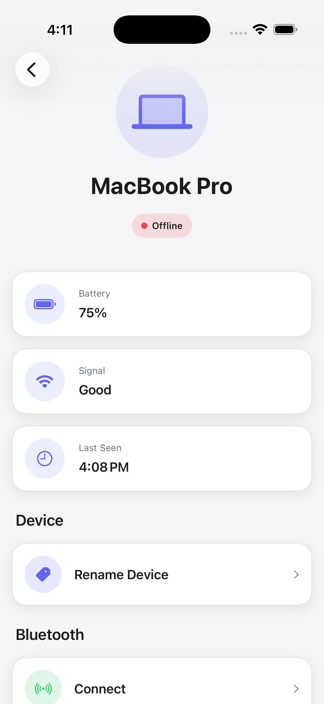
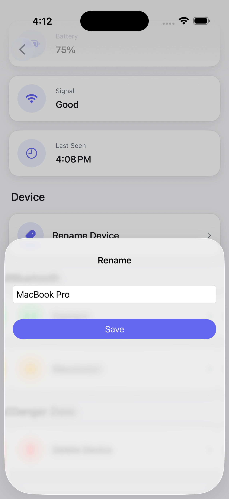

# 📍 SwiftTag

An **AirTag-inspired Bluetooth tracker** built with **SwiftUI**, following **MVVM**, **Repository Pattern**, and **SwiftData**. SwiftTag demonstrates how to architect a modern iOS application while simulating Bluetooth Low Energy (BLE) device discovery using a mock service.

> ⚠️ This project currently uses a **Mock BLE Scanner** for development and demonstration purposes. The architecture is designed so that the mock implementation can be replaced with **CoreBluetooth** with minimal changes.

---

## 📱 Screenshots

| Home | Scanner |
|------|----------|
|  |  |

| Detail | Rename |
|--------|---------|
|  |  |

---

## ✨ Features

- 📡 Simulated Bluetooth device discovery
- 🏷️ Rename tracked devices
- 🔋 Battery level monitoring
- 📶 Signal strength (RSSI) visualization
- 🔗 Connect and disconnect devices
- 🗑️ Delete saved trackers
- 💾 Local persistence using SwiftData
- 🎨 Modern SwiftUI interface
- 🧩 Modular MVVM architecture
- 🔄 Repository Pattern for clean separation of concerns

---

## 🏗️ Architecture

SwiftTag follows the **MVVM (Model-View-ViewModel)** architecture with a **Repository Pattern** to keep the UI independent of the data source.

### View
Responsible for rendering the user interface and handling user interactions.

### ViewModel
Contains presentation logic and exposes data to the views using Swift's Observation framework.

### Repository
Acts as the single source of truth and abstracts the underlying data and Bluetooth services.

### Mock BLE Service
Simulates nearby Bluetooth devices during development, making the app testable without physical hardware.

### SwiftData
Persists discovered devices locally.

---

## 🚀 Tech Stack

- Swift
- SwiftUI
- SwiftData
- MVVM Architecture
- Repository Pattern
- Observation Framework
- Async/Await
- NavigationStack
  

---

## 🤔 Why a Mock BLE Scanner?

Developing Bluetooth applications can be challenging because physical peripherals may not always be available.

To make development faster and the application easier to test, SwiftTag abstracts Bluetooth functionality behind a repository and currently uses a **Mock BLE Scanner** that generates sample devices.

Because of this architecture, replacing the mock implementation with Apple's **CoreBluetooth** framework requires minimal changes to the rest of the application.

---

## 🔮 Future Improvements

- Real CoreBluetooth integration
- Background Bluetooth scanning
- Device categories
- Device location history
- Cloud synchronization
- Find My–style precision finding
- Dark Mode support
- Unit and UI tests

---

## 👩‍💻 Author

**Palak Satti**

iOS Developer
---

## ⭐ If you found this project interesting

If you like this project, consider giving it a ⭐ on GitHub.
